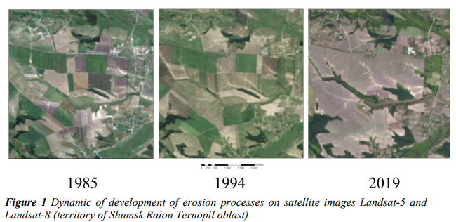

# Soil erosion detection solution report

This repository presents my solution report for quantum test task #4
<i>I didn't manage to complete it to the end, although i've delighted a huge amount of time to it, the task seems to be affordable to me</i>

### brif dive-into the problem

So from the following article ([Water Erosion: Types, Causes, Effects, And Prevention](https://eos.com/blog/water-erosion/)) i've figured out that soil erosion can lead to the soil degradation, which may cause significant yield drop, manmade infrastructure damage by landslides and floods  

It can be both caused by natural reasons and antropological ones. Our purpose is to detect Erosion on a ragional scale in order to take the necessary actions in time. 

### How do people usualy detect soil erosion:

[Remote Sensing in Monitoring of Erosion Processes](https://www.earthdoc.org/docserver/fulltext/2214-4609/2020/geoinf2020/GEOINF_2020_18400.pdf?expires=1662557534&id=id&accname=guest&checksum=23E136D041D316392704EC0D4455B304)  
There is a set of erosion factors - the topography, soils, vegetation, land use - so the perfomance of our model could be also improved by including this data as well. Satellite-based spectral indices, such as Normalized Difference Vegetation Index (NDVI), Normalized Difference Soil Index (NDSI), Tasseled Cap Transformation (TCT), along with Linear Spectral Unmixing Analysis (LSMA) have been frequently used to estimate soil erosion processes.  

During the analysis of a time sequence changes in the color, structure of soil, placement in space can be the indicators of their degradation.  

In recognition based on the knowledge, experience and skills of a specialist, direct deciphering features are defined: <i>shape, size, tone (brightness), structure or texture, spectral or photometric characteristics</i> - the features that are commonly processed by Conv Nets.

### Soil erosion detection using neural nets:

I've managed to find only two relevant papers on soil erosion detection with neural nets, both of them are providing a distinctive pipeline description and both of them are from russia:
- https://www.mdpi.com/2072-4292/14/9/2224/pdf?version=1651829956
- https://www.mdpi.com/2072-4292/12/11/1743/pdf?version=1591081806

## How to find a new efficient solution proposals?

Hence, in order to solve the problem we should figure out:

1. how people usually detect  the soil erosion by satellite pictures 
2. what are the most competitive segmentation techniques

And join this knowledge into an elegant solution

### Semantic segmentation task:

There are three general directions in semantic segmantation tasks:

1. Scene imagery
2. Medical imagery
3. Satellite imagery (ours)

## Segmentation for satellite imagery
### Baselines

Here is a convinient [ranking of nowadays SOTAs on Semantic Segmentations with benchmarks](https://paperswithcode.com/task/semantic-segmentation). And here is a description of [contemporary techniques](https://nanonets.com/blog/semantic-image-segmentation-2020/). <i> So, first of all i've investigated into the current state of knowledge and found out a little bit about the current baslines</i>

Most of nowaday solutions are axploiting [U-net for satellite imagery segmentation](https://deepsense.ai/satellite-images-semantic-segmentation-with-deep-learning/) - and this is a good point to start with when approaching to a new task. [CloudNet](https://paperswithcode.com/sota/semantic-segmentation-on-38-cloud) architecture seems to be relevant to our task as it comes about binary classification. Basically it is a U-Net-like model with slight deviations. implicates a novel loss function named Filtered Jaccard Loss (FJL). <i>I think, we could try to test this architecture, but there is no option to fine-tune it (due to another domain of a task), so the only way is to train it from scratch.</i>

[ICT-Net](https://paperswithcode.com/sota/semantic-segmentation-on-inria-aerial-image
https://www.researchgate.net/publication/334894696_On_Building_Classification_from_Remote_Sensor_Imagery_Using_Deep_Neural_Networks_and_the_Relation_Between_Classification_and_Reconstruction_Accuracy_Using_Border_Localization_as_Proxy) is an another one good baseline, in fact - improved U-Net.

[DeepLab V3+](https://paperswithcode.com/sota/semantic-segmentation-on-dronedeploy) combines Spatial Pyramidal Pooling and Kernel-Sharing Atrous Convolution (KSAC) - and for this moment this seems to be an advanced baseline.

[U-TAE] (https://paperswithcode.com/paper/panoptic-segmentation-of-satellite-image-tim) is an architecture, concieved for the time series. In fact, the problem we are facing is not about a static state of the relief. The erosion takes place anyway, the only thing that metters for us (humans) - is how fast it is. So, maybe considering the chronological sequences of satellite imagery will helps us better track the relief change and its impact, which would provide also possibility to rank areas from the most threatened to less ones.

### New approaches: Attention

Intuitively should be the one we need, because the erosed plot of land (which is relatively small) is supposed to be near the river (which is relatively long and narrow). In the same time the CNN's kernel is supposed to be compact, so its receptive field moving through the satellite image is not supposed to always keep in mind the entire river's configuration. In other words, sparse attention can is good at capturing long-range relations : 

- [High-Resolution Remote Sensing Image Segmentation Framework Based on Attention Mechanism and   Adaptive Weighting](https://www.researchgate.net/publication/350717817_High-Resolution_Remote_Sensing_Image_Segmentation_Framework_Based_on_Attention_Mechanism_and_Adaptive_Weighting)
- [Sparse spatial attention](https://arxiv.org/abs/2109.01915)
- [U-Net+attention = Spatial-Channel Attention U-Net](https://www.frontiersin.org/articles/10.3389/fbioe.2020.00670/full)
- [U-Net+attention](https://ieeexplore.ieee.org/document/9634020)

### New approaches: Transformers for encoder, decoder and all together

[FT-Unet](https://paperswithcode.com/sota/semantic-segmentation-on-isprs-potsdam) us an UNet-like Transformer. Uses CNN encoder and Global-Local Transformer decoder and MHSA, of course. <i>I think this is a great architecture to use.</i>

But in [this artical](https://medium.com/axinc-ai/dpt-segmentation-model-using-vision-transformer-b479f3027468) stated, that vision transformers are relevant only when a large amount of data is available.

[ViTAE-B trained on ISAID dataset](https://paperswithcode.com/sota/semantic-segmentation-on-isaid) or on [loveDA dataset](https://paperswithcode.com/sota/semantic-segmentation-on-loveda) is an [emergent architecture](https://arxiv.org/abs/2106.03348), which adopts the classical pyramid structure, improving the model transferability with the generated hierarchical multiscale features. Using vision transformers as the backbone for aerial scene recognition is still under-explored, while the existing method
merely takes ViT as a branch parallel to CNN. <i>Too difficult architecture for me, so i need a couple of days more to investigate into it</i> 

## My solution

<i>Well, i've tryed to start with DeepLabV3 first, because it is available among torchvision.models and there are pretrained weights. Further on i was planning to implement attention, but the last thing i've done - is a batch preprocessing for training (fine-tunning)</i>

